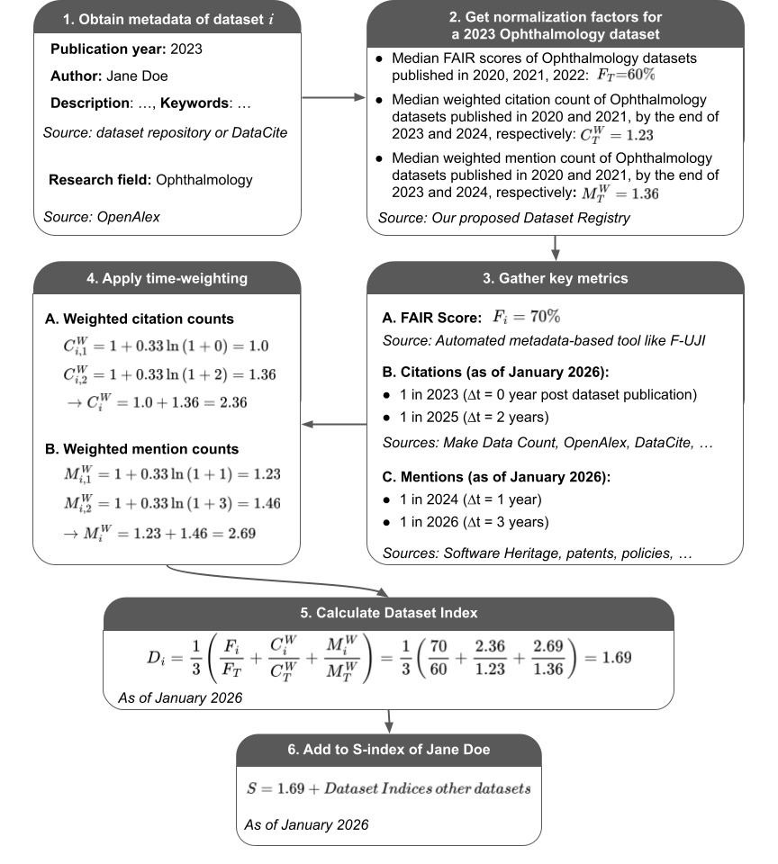
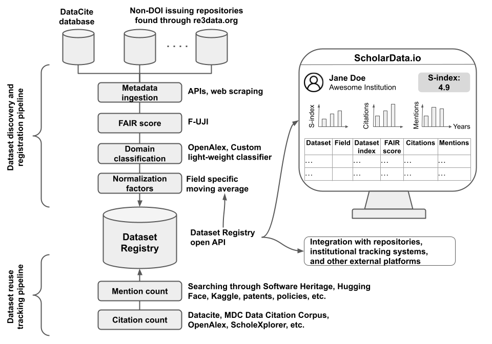

# Overview: A Simple and Field-Aware S-Index for Promoting and Rewarding Data Sharing

**This README provides an overview of the formulation and calculation of our S-index**

[![CC BY 4.0][cc-by-shield]][cc-by]

[cc-by]: http://creativecommons.org/licenses/by/4.0/
[cc-by-shield]: https://img.shields.io/badge/License-CC%20BY%204.0-lightgrey.svg

## Introduction  
Despite growing adoption of data sharing, there is still no standardized, transparent, and equitable way to measure and incentivize it. Our team is one of the finalists of the NIH S-index Challenge established to address this problem. As part of the Challenge, we propose the **S-index**, a metric that evaluates the data sharing impact of a researcher based on dataset-level signals of **FAIRness**, **citations**, and **alternative mentions**. Addressing limitations of existing metrics, our S-index is simple to interpret, incentivizing data sharing, field-sensitive, responsive to evolving practices, and feasible to implement sustainably using existing infrastructure. 

We provide below an overview of the formulation and calculation of our S-index. We refer to the [S-index Hub](https://github.com/data-S-index/hub) for more information about our S-index and related resources.

## Proposed S-index  
We introduce a framework in which a dataset $i$ is assigned a **Dataset Index** $D_i$ that combines FAIRness, scholarly citations, and alternative mentions. A researcher's **S-index** is then defined as the sum of the Dataset Indices of their $N$ datasets:

$$
D_i=\frac{1}{3}\left(\frac{F_i}{F_T}+\frac{C_{i}^w}{C_{T}^w}+\frac{M_{i}^w}{M_{T}^w}\right), 
\qquad
\text{S-index}=\sum_{i=1}^{N} D_i
$$

Here, $F_i$ is the FAIR score between 0 and 1 of dataset $i$. $C_{i}^w$ and $M_{i}^w$ are logarithmic time-weighted counts of the $P$ citations and $Q$ alternative mentions to dataset $i$:

$$
C_{i}^w=\sum_{c=1}^{P}\left[1+0.33\times\ln\left(1+\Delta t_{i,c}\right)\right],
\qquad
M_{i}^w=\sum_{q=1}^{Q}\left[1+0.33\times\ln\left(1+\Delta t_{i,q}\right)\right]
$$

Here, $\Delta t$ represents the time in years between the citation/mention event and the dataset’s publication. This weighting is designed to reward sustained reuse: a citation/mention on the day of dataset publication counts as 1, while one 20 years later counts as 2.

$F_T$, $C_{T}^w$, and $M_{T}^w$ are normalization factors intended to control for differences in field size, data reuse culture, and changing practices over time. They are calculated as 3-year moving medians based on datasets from the same field.

An example of S-index calculation is provided in **Fig. 1**. Calculation only requires dataset metadata from existing infrastructure (**Table 1**), enabling large-scale calculation regardless of dataset size, format, reuse license, and access conditions. Because no existing infrastructure aggregates these signals, we are building automated pipelines that find datasets, compute FAIR scores, identify citations and alternative mentions, and periodically update Dataset and S-indices (**Fig. 2**). As part of our testing and validation for Phase 2 of the NIH S-index Challenge, we calculated the Dataset-Index of 49M+ datasets and 1M+ S-index. They are accessible at [beta.scholardata.io](https://beta.scholardata.io), the Google-Scholar like platform we are building for researchers to find datasets and track their S-index the same way they track their manuscripts and h-index.

## Figures

  
   
  <em>Fig. 1. Example of the calculation of the Dataset Index of a dataset and the S-index of its author. Steps 1-5 need to be repeated for each dataset of the researcher to calculate their S-index. Steps 3B to 6 need to be repeated periodically (e.g., monthly) to account for new citations and mentions (the FAIR score will change if there are major updates to the data repository’s metadata practices, and normalization factors will change if we identify citations or mentions we may have missed in prior years).</em>

  
   
  <em>Fig. 2. Overview of the pipelines for collecting dataset-level data to compute the S-index of researchers</em>

## Table

Table 1. Major resources needed to calculate the proposed Dataset Index and S-index. All are free, and the majority are open source. All are existing infrastructure, except for the custom domain classification model we have fine-tuned to fill a gap for datasets without a domain assigned in OpenAlex. We have already used most of them in our large-scale testing and validation as part of our submission for Phase 2 of the NIH S-index Challenge.

| Purpose | Resources | Free? | Used in testing? |
|---|---|:---:|:---:|
| Discover new datasets with/without DOIs and register their metadata in the Dataset Registry | DataCite API (datasets with DOIs) | ✅ | ✅ |
|  | re3data API (finding non-DOI repositories) | ✅ | ❌ |
|  | Repository-specific APIs | Likely | ❌ |
|  | Web scraping tool like Scrapy (when allowed) | ✅ | ❌ |
| Compute FAIR scores | F-UJI | ✅ | ✅ |
| Find citations | MDC Data Citation Corpus | ✅ | ✅ |
|  | OpenAlex snapshot | ✅ | ✅ |
|  | DataCite API | ✅ | ✅ |
|  | ScholeXplorer | ✅ | ❌ |
| Find mentions in code (reuse in computational models, AI/ML, teaching course) | Software Heritage Graph Dataset | ✅ | ✅ |
|  | Hugging Face API (rate-limit) | ✅ | ✅ |
|  | Kaggle API (rate-limit) | ✅ | ❌ |
| Find mentions in patents (commercial reuse) | United States Patent and Trademark Office bulk downloads datasets | ✅ | ✅ |
|  | Lens.org for international patents (has a free tier) | ✅ | ❌ |
| Find mentions in policies (websites like WHO, UN, NIH, CDC) | Web scraping tool like Scrapy (when allowed) | ✅ | ❌ |
|  | PDF extractors like pdfminer.six | ✅ | ❌ |
| Assign research domain | OpenAlex taxonomy of research domains | ✅ | ✅ |
|  | OpenAlex snapshot | ✅ | ✅ |
|  | Custom domain classification model (self-hosted, for datasets not in OpenAlex) | ✅ | ✅ |

